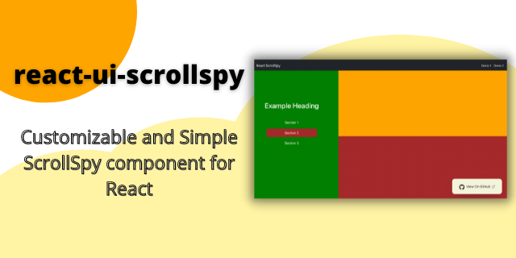

<div align="center">



# React UI ScrollSpy

[](https://npmjs.com/package/react-ui-scrollspy)
[](https://npmjs.com/package/react-ui-scrollspy)
[](https://raw.githubusercontent.com/pettiboy/react-ui-scrollspy/main/LICENSE)
[](https://github.com/pettiboy/react-ui-scrollspy/pulls)


Make sure you ⭐️ this [`repository`](https://github.com/pettiboy/react-ui-scrollspy) if you find it helpful or interesting :)

</div>

## ✨ Installation

### React 18

```bash
npm install --save react-ui-scrollspy
```

OR

```bash
yarn add react-ui-scrollspy
```

### React 17 and below

```bash
npm install --save react-ui-scrollspy@2.2.0
```

OR

```bash
yarn add react-ui-scrollspy@2.2.0
```

## 🎞 Demo

### Try it your self [here](https://pettiboy.github.io/react-ui-scrollspy)!

| [Demo 1](./demo-app/src/pages/Demo1.tsx)      | [Demo 2](./demo-app/src/pages/Demo2.tsx)       |
| :-------------------------------------------- | :--------------------------------------------- |
|  |  |

## ⚙️ Usage

1. In your navigation component

```tsx
<div>
  <p data-to-scrollspy-id="first">Section 1</p>
  <p data-to-scrollspy-id="second">Section 2</p>
</div>
```

2. Wrap the elements you want to spy on in the `<ScrollSpy>` component.

<!-- prettier-ignore -->
```tsx
import ScrollSpy from "react-ui-scrollspy";

<ScrollSpy>
  <div id="first">
    Lorem ipsum dolor sit amet consectetur adipisicing elit. Aut dolores
    veritatis doloremque fugit. Soluta aperiam atque inventore deleniti,
    voluptatibus non fuga eos magni natus vel, rerum excepturi expedita.
    Tempore, vero!
  </div>
  <div id="second">
    Lorem ipsum dolor sit amet consectetur adipisicing elit. Aut dolores
    veritatis doloremque fugit. Soluta aperiam atque inventore deleniti,
    voluptatibus non fuga eos magni natus vel, rerum excepturi expedita.
    Tempore, vero!
  </div>
</ScrollSpy>
```

3. Write styles for when the navigation element which is active in your `index.css`

```css
.active-scroll-spy {
  background-color: yellowgreen;
  border-radius: 15px;
}
```

## 📝 Notes

Incase the ScrollSpy is not working the way you expected, you can try the following:

- Reduce the value of [`scrollThrottle`](#-throttle).

- If your page contains a `navbar` a `header` consider adding the following `CSS`

```css
html {
  scroll-padding-top: 120px; /* height of your navbar */
}
```

- Try using [`offsets`](#-offsets).

- Go through the [`Props`](#-props).

- See [`demo-app`](./demo-app/src/App.tsx) for example used [here](https://pettiboy.github.io/react-ui-scrollspy).

## 💡 Props

### 🔧 Children

| Attributes | Type        | Description                                        | Default | Required |
| :--------- | :---------- | :------------------------------------------------- | :------ | :------- |
| `children` | `ReactNode` | Each direct child `Element` should contain an `id` | -       | yes      |

### 🔧 Refs

| Attributes                 | Type                                              | Description                                                                                             | Default | Required |
| :------------------------- | :------------------------------------------------ | :------------------------------------------------------------------------------------------------------ | :------ | :------- |
| `navContainerRef`          | MutableRefObject<br><HTMLDivElement \| null><br/> | `ref` to your navigation container containing items with `data-to-scrollspy-id` attributes              | -       | no       |
| `parentScrollContainerRef` | MutableRefObject<br><HTMLDivElement \| null><br/> | If you want to spy only on a particular scrollable `container (Element)` then pass its ref to this prop | -       | no       |

### 🔧 Throttle

| Attributes       | Type     | Description                                                                                                                 | Default | Required |
| :--------------- | :------- | :-------------------------------------------------------------------------------------------------------------------------- | :------ | :------- |
| `scrollThrottle` | `number` | In `milliseconds` to throttle the `onscroll` event. Lower the number, better the response time, higher the performance cost | `300`   | no       |

### 🔧 Callback

| Attributes         | Type                   | Description                                                                                                                        | Default | Required |
| :----------------- | :--------------------- | :--------------------------------------------------------------------------------------------------------------------------------- | :------ | :------- |
| `onUpdateCallback` | `(id: string) => void` | Executes this function whenever you scroll to a new ScrollSpy child `Element`, callback returns the `id` of that `Element` as well | -       | no       |

### 🔧 Offsets

| Attributes     | Type     | Description                                                                                                     | Default | Required |
| :------------- | :------- | :-------------------------------------------------------------------------------------------------------------- | :------ | :------- |
| `offsetTop`    | `number` | Spy will be fired when it has been scrolled `offsetTop` beyond `50%` to the top of the containing element       | `0`     | no       |
| `offsetBottom` | `number` | Spy will be fired when it has been scrolled `offsetBottom` beyond `50%` to the bottom of the containing element | `0`     | no       |

### 🔧 Customize Attributes

| Attributes         | Type      | Description                                                                                               | Default               | Required |
| :----------------- | :-------- | :-------------------------------------------------------------------------------------------------------- | :-------------------- | :------- |
| `useDataAttribute` | `string`  | To customize the string after `data-`                                                                     | `"to-scrollspy-id"`   | no       |
| `activeClass`      | `string`  | To customize the `class` added when the `Element` in view                                                 | `"active-scroll-spy"` | no       |
| `useBoxMethod`     | `boolean` | Set to `false` if you want your spy to be active only if more than `50%` of that `div` is in the viewport | `true`                | no       |
| `updateHistoryStack` | `boolean` | Set to `false` to disable the URL getting automatically updated when scrolling                          | `true`                | no

##

## 📝 Authors

- Hussain Pettiwala ([@pettiboy](https://github.com/pettiboy))
